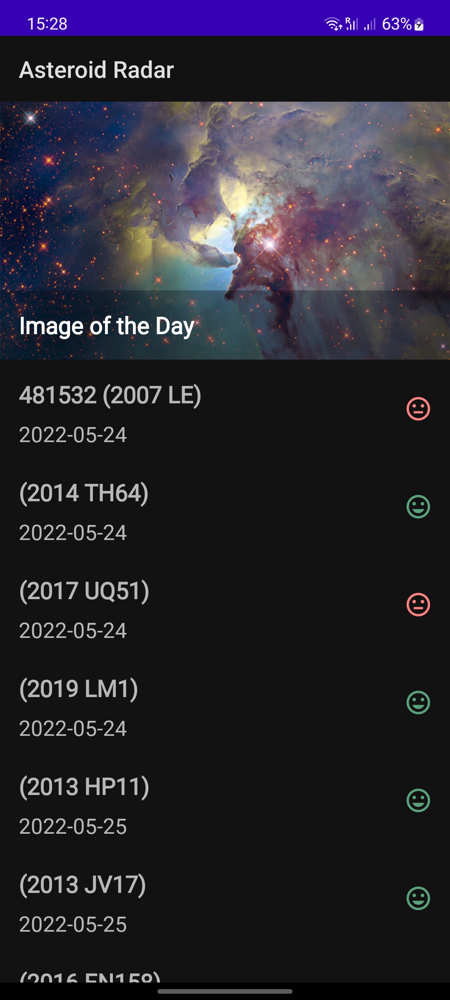
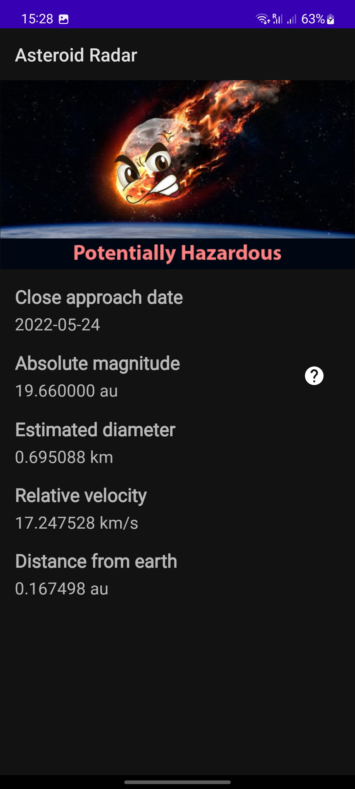
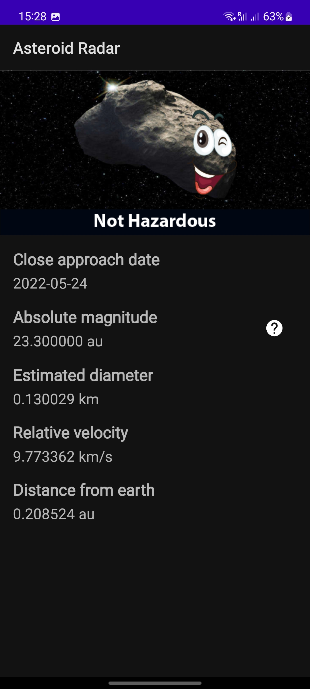
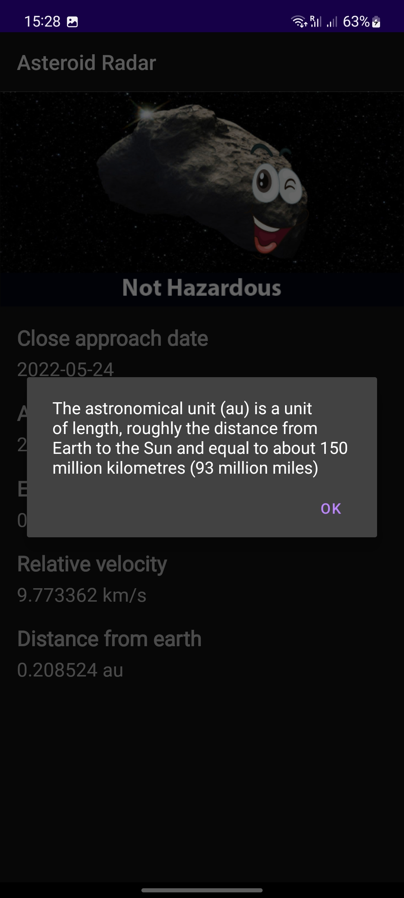

# Asteroid Radar

## Table of contents

- [Overview](#overview)
  - [Screenshots](#screenshots)
  - [Dependencies](#dependencies)
  - [Installation](#installation)
- [Built With](#built-with)

## Overview

Asteroid Radar is an app to view the asteroids detected by NASA that pass near Earth, you can view all the detected asteroids in a period of time, their data (Size, velocity, distance to Earth) and if they are potentially hazardous.

The app is consists of two screens: A Main screen with a list of all the detected asteroids and a Details screen that is displaying the data of that asteroid once it's selected in the Main screen list. The main screen also shows the NASA image of the day to make the app more striking.

### Screenshots






### Dependencies

The most important dependencies we are using are:

- Retrofit to download the data from the Internet.
- Moshi to convert the JSON data we are downloading to usable data in form of custom classes.
- Picasso to download and cache images.
- RecyclerView to display the asteroids in a list.

```
implementation 'androidx.core:core-ktx:1.7.0'
implementation 'androidx.appcompat:appcompat:1.4.1'
implementation 'com.google.android.material:material:1.6.0'
implementation 'androidx.constraintlayout:constraintlayout:2.1.3'
implementation 'androidx.navigation:navigation-fragment-ktx:2.4.2'
implementation 'androidx.navigation:navigation-ui-ktx:2.4.2'
implementation "androidx.recyclerview:recyclerview:1.2.1"

// Room
implementation "androidx.room:room-runtime:2.4.2"
kapt "androidx.room:room-compiler:2.4.2"

// Work
implementation "androidx.work:work-runtime-ktx:2.7.1"

// Network
implementation "com.squareup.moshi:moshi:1.9.3"
implementation "com.squareup.moshi:moshi-kotlin:1.9.3"
implementation "com.squareup.retrofit2:retrofit:2.9.0"
implementation "com.squareup.retrofit2:converter-moshi:2.9.0"
implementation 'com.squareup.retrofit2:converter-scalars:2.5.0'

// Coroutines
implementation "org.jetbrains.kotlinx:kotlinx-coroutines-core:1.6.1"
implementation "org.jetbrains.kotlinx:kotlinx-coroutines-android:1.6.1"
implementation "com.jakewharton.retrofit:retrofit2-kotlin-coroutines-adapter:0.9.2"

implementation 'com.squareup.picasso:picasso:2.71828'

testImplementation 'junit:junit:4.13.2'
androidTestImplementation 'androidx.test.ext:junit:1.1.3'
androidTestImplementation 'androidx.test.espresso:espresso-core:3.4.0'
```

### Installation

To get the project running on your local machine, you need to follow these steps:

**Step 1: Clone the repo**

Use this to clone it to your local machine:

```bash
git clone https://github.com/andrejcode/asteroid-radar
```

**Step 2: Check out the 'main' branch**

This branch is going to let you start working with it. The command to check out a branch would be:

```bash
git checkout main
```

**Step 3: Run the project and check that it compiles correctly**

Open the project in Android Studio and click the Run 'app' button, check that it runs correctly and you can see the app in your device or emulator.

## Built With

To build this project you are going to use the NASA NeoWS (Near Earth Object Web Service) API, which you can find here.
https://api.nasa.gov/

You will need an API Key which is provided for you in that same link, just fill the fields in the form and click Signup.
Save your API key inside local.properties file so you don't check it into your version control system.
See [Gradle Secrets plugin](https://developers.google.com/maps/documentation/places/android-sdk/secrets-gradle-plugin) for more information.